# 🧩 Tarea SSH y SCP

- Crea dos máquinas virtuales y realiza el siguiente proceso.

- Dentro de la misma red y conectado por SSH a los puertos:
  - Máquina A: puerto 2222
  - Máquina B: puerto 2223

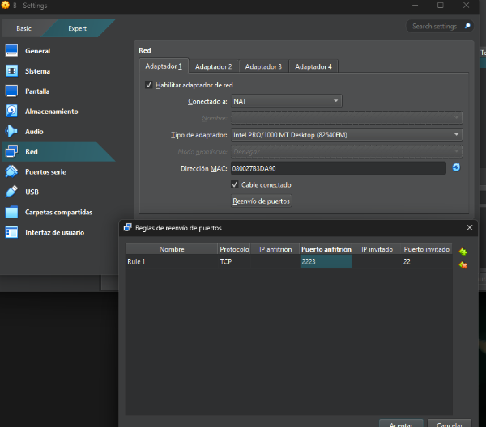
- En la máquina A vamos a crear el usuario **Alex** y en la máquina B el usuario **Brais**.
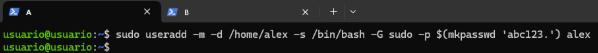

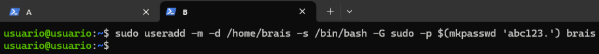

- Nuestra máquina A va a actuar como **cliente** y la máquina B como **servidor**.

- Realiza el proceso de conexión de una máquina A hacia B explicando el comando.  
  ¿Qué se crea cuando nos conectamos al servidor desde el cliente?

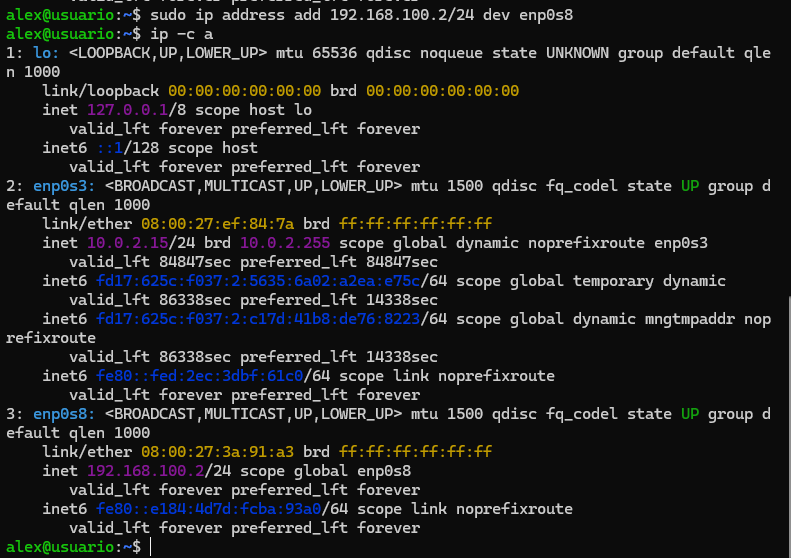

- Crea el directorio `prueba` con el archivo `prueba.txt` en la ruta temporal de A y envía la información al servidor.

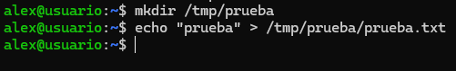

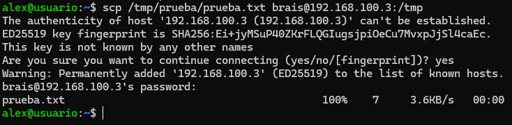

- Crea el directorio `prueba2` con el archivo `prueba2.txt` en la ruta temporal del servidor y envíala al cliente.

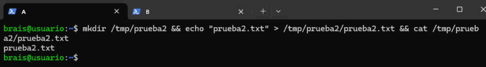

- Transmite los directorios `prueba` y `prueba2` a tu ordenador anfitrión al escritorio.

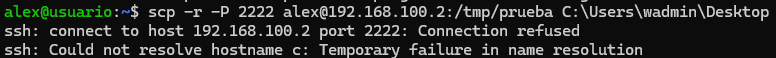

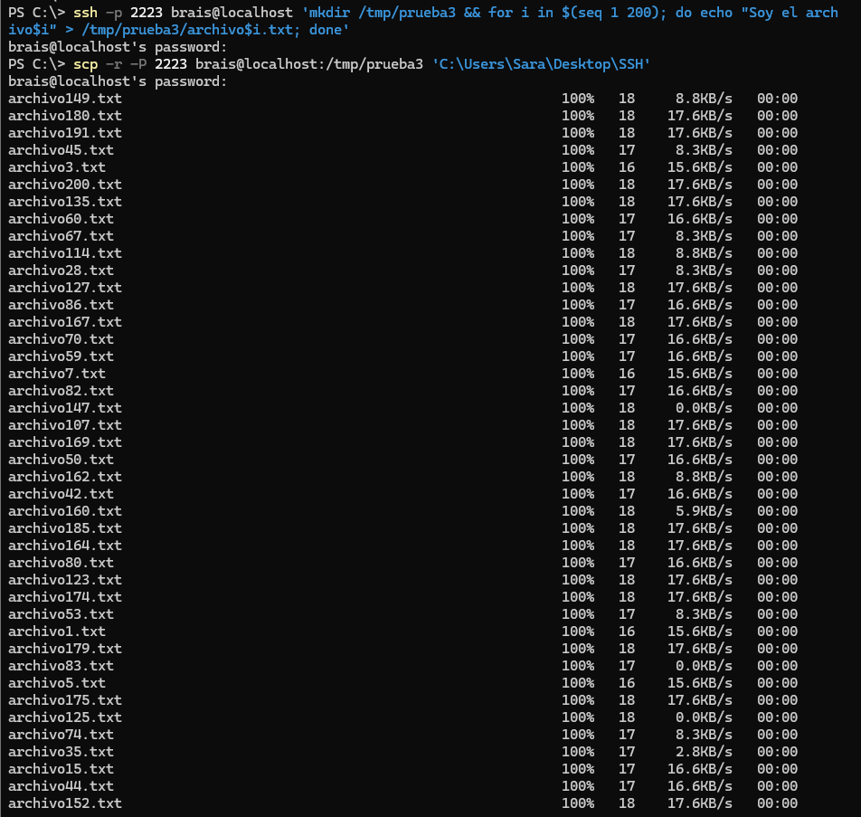

- Crea el directorio `prueba3` con 200 archivos `.txt` en el servidor y transmítelo al escritorio del ordenador.

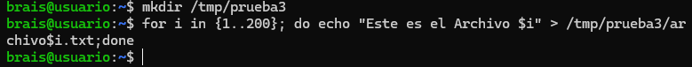

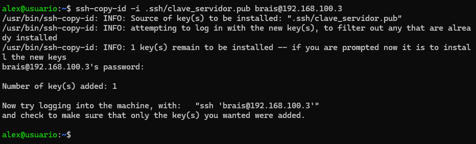

- Genera un par de claves en el cliente y haz la conexión con el servidor.  
  Crea el passphrase: `servidorssh`.

  

  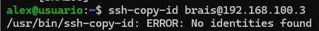

